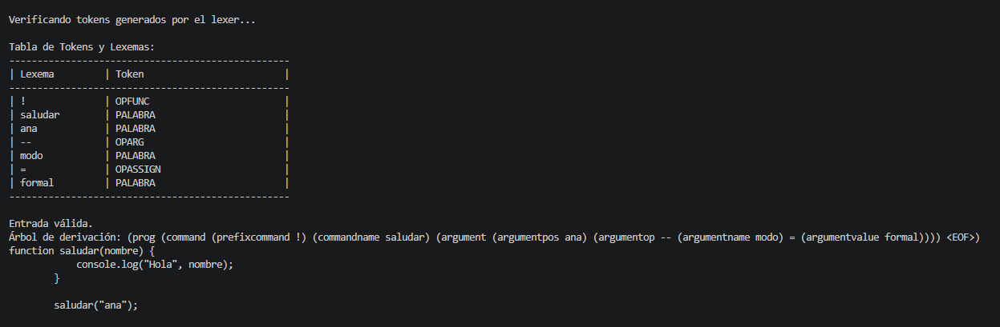

# README

## Descripción
Este proyecto implementa un pequeño traductor utilizando:

- ANTLR4
- JavaScript (Node.js)

Se define un lenguaje custom basado en la gramática asignada y al correr el proyecto se realiza un analisis léxico y sintáctico de la entrada y se traduce a JavaScript.

## Instalación

1. Clonar el repositorio: git clone https://github.com/nairpa/52567.git
2. Posicionarse en la carpeta del proyecto ```ssl-customlanguage``` y correr el comando ```npm i``` para instalación de dependecias necesarias.

## Instrucciones de Uso

Una vez realizado el paso de *instalación* se puede
1. Correr el proyecto con la entrada por defecto *input.txt* esto deberia generar en la linea de comando el siguiente detalle

2. Modificar la entrada de datos en *input.txt* para obtener otro valor
3. Usar alguno de las otras entradas de ejemplo